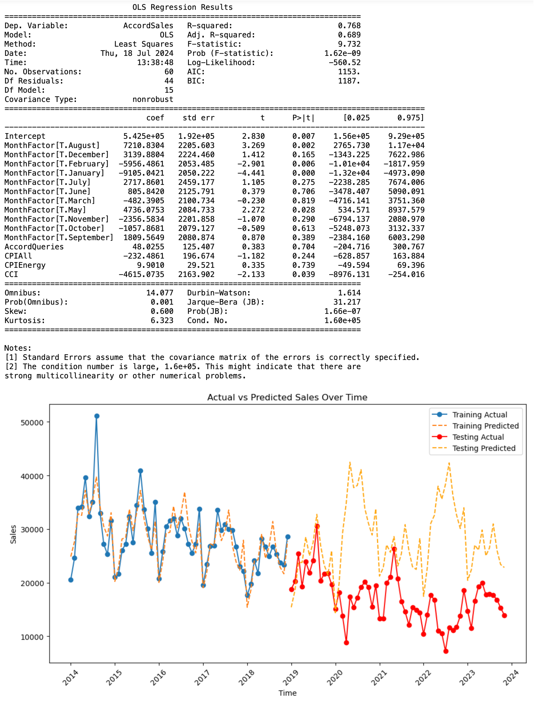

# Analysis of Forecasting Honda Accord Sales

## Introduction
Nearly all companies aim to accurately predict future sales of their products. Accurate predictions enable companies to align production with customer demand, reducing unnecessary inventory costs and ensuring they can meet market demand. This exercise focuses on predicting the monthly sales of the Honda Accord automobile in the United States. Honda, one of the top car manufacturers globally, has been producing the Accord model since 1981. This project uses linear regression to predict monthly sales using various economic indicators and Google search query volumes.

## Data Overview
The dataset contains monthly observations from January 2014 through November 2023. Key variables include:
- **Unemployment**
- **AccordQueries**
- **CPIAll**
- **CPIEnergy**
- **MilesTraveled**

## Methodology

### Data Splitting
The dataset is split into a training set (2014-2018) and a testing set (January 2019 - November 2023).

```python
import pandas as pd

# Load data
Accord = pd.read_csv('Accord-242A-Spring24.csv')

# Split data
Accord_train = Accord[Accord['Year'] <= 2018]
Accord_test = Accord[Accord['Year'] > 2018]

print('Training observation from 2014 - 2018:', len(Accord_train))
print('Testing observation from Jan 2018 - Nov 2023:', len(Accord_test))
```

### Initial Linear Regression Model
Consider the five independent variables: Unemployment, AccordQueries, CPIAll, CPIEnergy, and MilesTraveled. The initial model uses all these variables to predict monthly Accord sales (AccordSales).

```python
import statsmodels.api as sm

# Define features and target
cols = ['Unemployment', 'AccordQueries', 'CPIAll', 'CPIEnergy', 'MilesTraveled']
X_train = Accord_train[cols]
y_train = Accord_train['AccordSales']

# Add intercept
X_train = sm.add_constant(X_train)

# Fit model
model1 = sm.OLS(y_train, X_train).fit()
print(model1.summary())
```


### Model Improvement
The initial model's equation is:
\[ \text{AccordSales} = 1.735e+05 - 1833.6589 \times \text{Unemployment} + 225.2323 \times \text{AccordQueries} - 1443.0327 \times \text{CPIAll} + 192.5350 \times \text{CPIEnergy} + 0.5860 \times \text{MilesTraveled} \]

Interpretation of coefficients:
- **Intercept:** Estimated sales when all independent variables are zero (141,900 units).
- **AccordQueries:** For a one-unit increase, sales increase by 245.21 units.
- **CPIAll:** For a one-unit increase, sales decrease by 610.92 units.
- **CPIEnergy:** For a one-unit increase, sales increase by 67.03 units.

### Variable Selection
Using regression skills, the goal is to build a high-quality model by selecting the most relevant variables. The chosen model:
AccordSales = 1.419e+05 + 245.2054 * AccordQueries - 610.9156 * CPIAll} + 67.0291 * CPIEnergy

## Model Evaluation
To evaluate the models, we consider R-squared values, Adjusted R-squared, F-statistic, and VIF (Variance Inflation Factor) to address multicollinearity.

### Model Comparison

| Model                         | R^2    | Adj. R^2 | F-stat | VIF (highest)       |
|-------------------------------|--------|----------|--------|---------------------|
| Original                      | 0.254  | 0.185    | 3.683  | Unemployment: 31.68 |
| Removed Unemployment          | 0.252  | 0.198    | 4.636  | CPIAll: 14.07       |
| Removed Unemployment & MilesTraveled | 0.227  | 0.185    | 5.475  | CPIAll: 1.82        |
| Removed Unemployment & CPIAll | 0.157  | 0.112    | 3.482  | MilesTraveled: 2.29 |
| Removed CPIAll                | 0.210  | 0.153    | 3.660  | Unemployment: 9.84  |
| Removed CPIAll & MilesTraveled | 0.209  | 0.167    | 4.938  | Unemployment: 2.25  |

From Table 1, the criteria for selecting the model were to obtain the lowest VIFs possible to address multicollinearity while maintaining a reasonable R-squared value and considering the significant levels of variables (p-values).

## Analysis of Coefficients
- **AccordQueries:** Positive coefficient suggests higher searches lead to higher sales, which is intuitive unless negative search results prevail.
- **CPIEnergy:** Positive sign may seem counterintuitive but can indicate energy-efficient sales.
- **CPIAll:** Negative sign indicates market contraction with rising prices, leading to fewer car purchases.

## Model Performance on Training Data
To assess Model 3, the R-squared value is 0.227, indicating approximately 22.7% variance in AccordSales is explained by the model's variables.

## Incorporating Seasonality
Seasonality is important in predicting demand as it tends to be periodic. Adding MonthFactor as an independent variable captures this effect.

```python
ols7 = smf.ols(formula='AccordSales ~ MonthFactor + Unemployment + CPIAll + CPIEnergy + MilesTraveled', data=Accord_train)
model7 = ols7.fit()
print(model7.summary())
```


The new model's R-squared is 0.748, indicating approximately 74.8% variance explanation. Significant MonthFactor variables include August, January, and May.

## Final Model with Consumer Confidence Index (CCI)
Adding CCI improves the model slightly but doesn't perform well on new data, as indicated by a negative OSR2.

```python
cci_data = pd.DataFrame({
    'Month': pd.date_range(start='2014-01-01', end='2023-11-01', freq='MS'),
    'CCI': [/* Insert CCI data here */]
})
Accord['Month'] = pd.to_datetime(Accord['Year'].astype(str) + '-' + Accord['MonthNumeric'].astype(str))
Accord = pd.merge(Accord, cci_data, on='Month', how='left')
Accord = Accord.drop(columns=['Month'])

# Fit final model
ols9 = smf.ols(formula='AccordSales ~ MonthFactor + AccordQueries + CPIAll + CPIEnergy + CCI', data=Accord_train)
model9 = ols9.fit()
print(model9.summary())
```

## Visualizing Model Performance
```python
import matplotlib.pyplot as plt

# Predict values
y_pred = model9.predict(X_train)

# Create time series
time_series = pd.to_datetime(Accord_train['Year'].astype(str) + '-' + Accord_train['MonthNumeric'].astype(str))

# Plot actual vs predicted sales
plt.figure(figsize=(10, 4))
plt.plot(time_series, Accord_train['AccordSales'], label='Actual', marker='o')
plt.plot(time_series, y_pred, label='Predicted', linestyle='--')
plt.title('Actual vs Predicted Sales Over Time')
plt.xlabel('Time')
plt.ylabel('Sales')
plt.legend()
plt.xticks(rotation=45)
plt.tight_layout()
plt.show()
```


## Conclusion
The final model incorporating MonthFactor and economic indicators shows a significant improvement in explaining sales variance. However, the negative OSR2 value when adding CCI suggests overfitting and poor generalization to new data.
