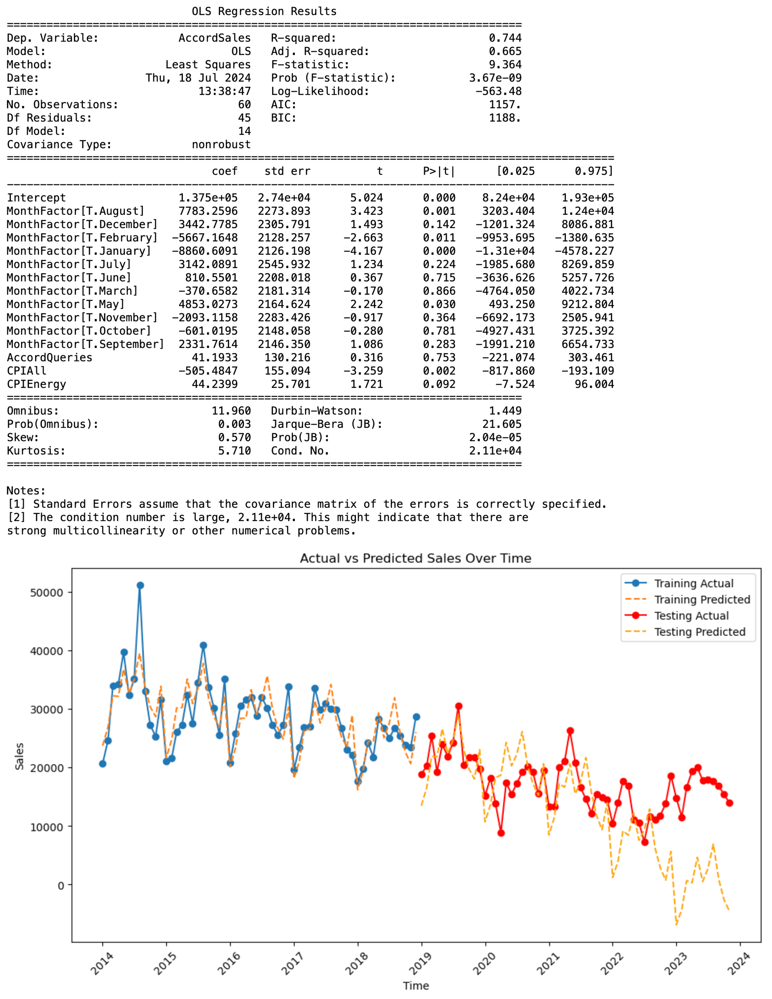

# Forecasting Honda Accord Sales

This project aims to predict the monthly sales of the Honda Accord in the United States using linear regression, economic indicators, and Google search query volumes. The data spans from January 2014 to November 2023, allowing for a comprehensive analysis of sales trends over nearly a decade.

## Project Overview

Accurately predicting future sales enables Honda to align production with customer demand, minimizing inventory costs while satisfying market needs. This project employs various statistical methods and models to achieve this goal.

## Objectives

- Accurately forecast future sales.
- Analyze the impact of various economic indicators on sales performance.
- Explore the influence of seasonality on sales figures.

## Methodology

### Data Preparation

1. **Load and Inspect Data:**
    ```python
    import pandas as pd
    Accord = pd.read_csv('Accord-242A-Spring24.csv')
    Accord.info()
    Accord.head(5)
    ```
     <!-- Replace with actual path to your image -->

2. **Split Data:**
    ```python
    Accord_train = Accord[Accord['Year'] <= 2018]
    Accord_test = Accord[Accord['Year'] > 2018]
    print('Training observation from 2014 - 2018:', len(Accord_train))
    print('Testing observation from Jan 2018 - Nov 2023:', len(Accord_test))
    ```
     <!-- Replace with actual path to your image -->
   
### Initial Model Development

1. **Build Initial Model:**
    ```python
    import statsmodels.api as sm
    cols = ['Unemployment', 'AccordQueries', 'CPIAll', 'CPIEnergy', 'MilesTraveled']
    X_train = Accord_train[cols]
    y_train = Accord_train['AccordSales']
    X_train = sm.add_constant(X_train)
    model1 = sm.OLS(y_train, X_train).fit()
    print(model1.summary())
    ```
     <!-- Replace with actual path to your image -->

2. **Evaluate Multicollinearity:**
    ```python
    from statsmodels.stats.outliers_influence import variance_inflation_factor
    def VIF(df, columns):
        values = sm.add_constant(df[columns]).values
        num_columns = len(columns)+1
        vif = [variance_inflation_factor(values, i) for i in range(num_columns)]
        return pd.Series(vif[1:], index=columns)
    VIF(Accord_train, cols)
    ```
     <!-- Replace with actual path to your image -->
   
### Model Improvement

1. **Remove Variables with High Multicollinearity:**
    ```python
    ols2 = smf.ols(formula='AccordSales ~ AccordQueries + CPIAll + CPIEnergy + MilesTraveled', data=Accord_train)
    model2 = ols2.fit()
    print(model2.summary())
    VIF(Accord_train, ['AccordQueries', 'CPIAll', 'CPIEnergy', 'MilesTraveled'])
    ```
     <!-- Replace with actual path to your image -->

### Incorporating Seasonality

1. **Add MonthFactor:**
    ```python
    ols8 = smf.ols(formula='AccordSales ~ MonthFactor + AccordQueries + CPIAll + CPIEnergy', data=Accord_train)
    model8 = ols8.fit()
    print(model8.summary())
    ```
     <!-- Replace with actual path to your image -->

### Final Model with Consumer Confidence Index (CCI)

1. **Add CCI Feature:**
    ```python
    cci_data = pd.DataFrame({
        'Month': pd.date_range(start='2014-01-01', end='2023-11-01', freq='MS'),
        'CCI': [/* Insert CCI data here */]
    })
    Accord['Month'] = pd.to_datetime(Accord['Year'].astype(str) + '-' + Accord['MonthNumeric'].astype(str))
    Accord = pd.merge(Accord, cci_data, on='Month', how='left')
    Accord = Accord.drop(columns=['Month'])
    ```

2. **Build Final Model:**
    ```python
    ols9 = smf.ols(formula='AccordSales ~ MonthFactor + AccordQueries + CPIAll + CPIEnergy + CCI', data=Accord_train)
    model9 = ols9.fit()
    print(model9.summary())
    ```

### Results and Visualizations

1. **Plot Actual vs. Predicted Sales:**
    ```python
    import matplotlib.pyplot as plt
    y_pred = model9.predict(X_train)
    time_series = pd.to_datetime(Accord_train['Year'].astype(str) + '-' + Accord_train['MonthNumeric'].astype(str))
    plt.figure(figsize=(10, 4))
    plt.plot(time_series, Accord_train['AccordSales'], label='Actual', marker='o')
    plt.plot(time_series, y_pred, label='Predicted', linestyle='--')
    plt.title('Actual vs Predicted Sales Over Time')
    plt.xlabel('Time')
    plt.ylabel('Sales')
    plt.legend()
    plt.xticks(rotation=45)
    plt.tight_layout()
    plt.show()
    ```
     <!-- Replace with actual path to your image -->

### Out-of-Sample R2 (OSR2)

1. **Calculate OSR2:**
    ```python
    def OSR2(model, df_train, df_test, dependent_var):
        y_test = df_test[dependent_var]
        y_pred = model.predict(df_test)
        SSE = np.sum((y_test - y_pred)**2)
        SST = np.sum((y_test - np.mean(df_train[dependent_var]))**2)
        return 1 - SSE/SST
    print('OSR2 of the latest model is:')
    OSR2(model9, Accord_train, Accord_test, 'AccordSales')
    ```

2. **Plot Actual vs Predicted Sales for Training and Testing Data:**
    ```python
    y_pred_train = model9.predict(X_train)
    y_pred_test = model9.predict(X_test)
    plt.figure(figsize=(10, 6))
    plt.plot(time_series_train, Accord_train['AccordSales'], label='Training Actual', marker='o')
    plt.plot(time_series_train, y_pred_train, label='Training Predicted', linestyle='--')
    plt.plot(time_series_test, Accord_test['AccordSales'], label='Testing Actual', marker='o', color='red')
    plt.plot(time_series_test, y_pred_test, label='Testing Predicted', linestyle='--', color='orange')
    plt.title('Actual vs Predicted Sales Over Time')
    plt.xlabel('Time')
    plt.ylabel('Sales')
    plt.legend()
    plt.xticks(rotation=45)
    plt.tight_layout()
    plt.show()
    ```
     <!-- Replace with actual path to your image -->

## Conclusion

This project demonstrates the application of linear regression in forecasting sales, highlighting the importance of considering both economic indicators and seasonal trends. The analysis provides valuable insights for production planning and inventory management, showcasing the practical implications of data science in the automotive industry.

## Technologies Used

- Python (Pandas, Statsmodels, Matplotlib)
- Jupyter Notebook

## How to Use

1. Clone the repository:
    ```bash
    git clone https://github.com/your-username/honda-accord-sales-forecasting.git
    ```
2. Navigate into the project directory:
    ```bash
    cd honda-accord-sales-forecasting
    ```
3. Run the analysis:
    ```bash
    jupyter notebook
    ```

## License

Specify the license for your project.
